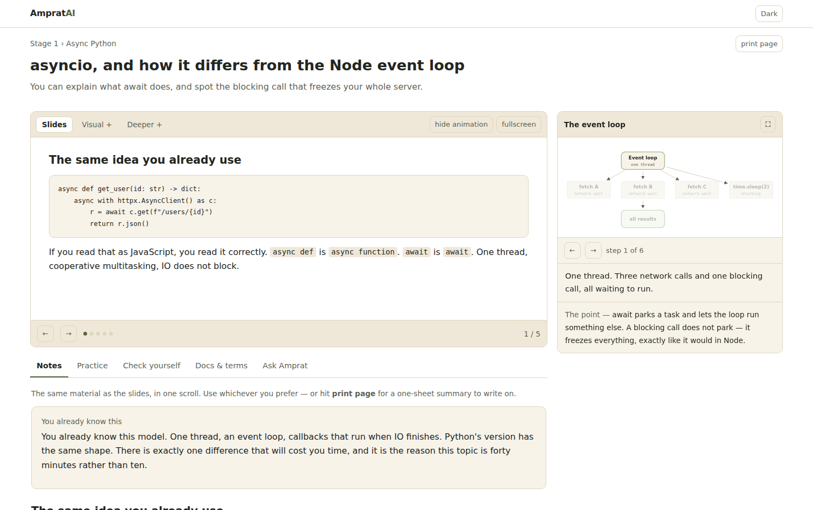

# AmpratAI

A personal learning platform and a custom roadmap for becoming a full-stack AI engineer.

Built for one person: a MERN full-stack developer with some Python, SQL from MySQL, 300+ DSA
problems, and one basic RAG project — going from there to competitive for the best AI
engineering roles.

**The platform is built for you, not by you.** Your job is to learn.



## Run it

```bash
npm install
npm run dev          # http://localhost:3000
```

That is the whole setup. No database, no API keys, no accounts. Progress saves in your
browser.

## What is in it

**Seven stages.** Stage 1 is fully written — 38 topics across Python for AI code, pydantic,
async, tooling, FastAPI, the Postgres conversion, Docker, and eight hours of AI intuition.
Stages 2 to 7 are planned and visible, and get written as you approach them so nothing is
stale by the time you reach it.

**Every topic has three parts.**
- **Concepts** — slides written for you, plus curated searches for videos worth watching.
  Plain language, an analogy to something you already know, and a printable one-page summary.
- **Practice** — five kinds: hand-write a primitive, read code and predict, spec it then
  review what AI wrote, use a real tool, or decide and defend. You do these in your own editor.
- **Mini-projects** — thirteen briefs written as work tickets, aimed high because you build
  with AI assistance.

**Animations** that show mechanism — step through them with the arrow keys, drag the knobs,
and watch what changes. Seven of them ship with Stage 1.

**No deadlines.** No streaks, no time boxes, no quotas, nothing expires. Stop for exams and
come back; it opens where you left off.

## Making progress follow you across devices

Optional. Without it, progress lives in your browser and works fine.

1. Create a free cluster at [MongoDB Atlas](https://www.mongodb.com/cloud/atlas)
2. Copy `.env.example` to `.env` and fill in:
   ```
   MONGODB_URI=mongodb+srv://...
   AMPRAT_SYNC_TOKEN=any-long-random-string
   ```
3. Use the same token on every device

The app keeps whichever copy is newer. If the database is unreachable, it silently falls
back to local storage — nothing breaks.

## Deploy it

Push to GitHub, import the repo on [Vercel](https://vercel.com), and add the two environment
variables if you want cross-device sync. Nothing else to configure.

## About the videos

Videos are not hard-coded. Each topic ships a curated search — the right query, on the right
channel, with a line about what that source is good for — and when you find the one that
actually helps, you paste the link and it stays pinned for you.

This is deliberate. Hard-coded video IDs rot: videos get deleted, made private, or replaced
by something better. A search that names the channel does not.

## Layout

```
app/                  routes: home, stage, topic, project, print, progress API
components/           the topic screen, deck viewer, animation engine
content/
  curriculum.ts       seven stages, modules, readiness checks
  topics/             Stage 1 content — 38 topics
  animations/         animation specs
  projects.ts         13 project briefs
lib/                  types, markdown, progress
docs/                 the roadmap and the plan behind all of this
```

## The plan behind it

The reasoning — why this order, what to skip, where it disagrees with the usual advice — is
in [`docs/00-INDEX.md`](docs/00-INDEX.md).

Start with [`docs/01-PROFILE-AND-GAP-ANALYSIS.md`](docs/01-PROFILE-AND-GAP-ANALYSIS.md) and
[`docs/02-ROADMAP.md`](docs/02-ROADMAP.md).

## Renaming the repository

This repo is still called `NexHireAI` on GitHub. Rename it in Settings → General →
Repository name, then:

```bash
git remote set-url origin https://github.com/keshav-pec/AmpratAI
```

GitHub redirects the old URL, so nothing breaks in the meantime.
